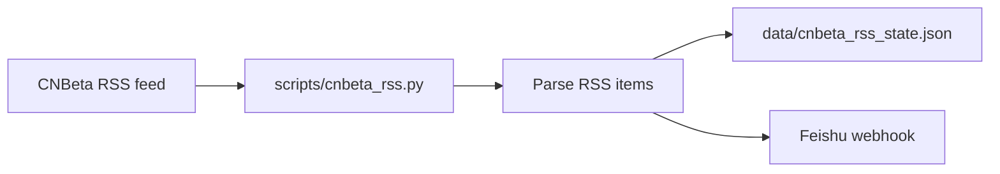

# CNBeta RSS → Feishu aggregator

## Purpose

A small Python script fetches the latest articles from [CNBeta RSS](https://rss.cnbeta.com.tw) and pushes new items to a Feishu group via custom bot webhook.

## Data flow



1. **Fetch** one or more RSS feeds (default: main CNBeta feed).
2. **Parse** title, link, publish time, category (from URL path), and summary.
3. **Dedupe** against a local state file of seen article links.
4. **Send** up to `CNBETA_RSS_MAX_ITEMS` new articles to Feishu as an interactive card (or plain text).

## RSS source

| Feed | URL | Notes |
|------|-----|-------|
| Main (all categories) | `https://rss.cnbeta.com.tw` | ~150 recent items; categories appear in article URLs (`/articles/tech/`, `/articles/game/`, etc.) |

Category-specific RSS paths were tested and return 404; the main feed is the supported source.

## Configuration

See [feishu-setup.md](./feishu-setup.md) for webhook setup and environment variables.

Core entrypoint:

```bash
python scripts/cnbeta_rss.py
```

## Repository layout

| Path | Role |
|------|------|
| `scripts/cnbeta_rss.py` | Fetch, parse, dedupe, notify |
| `scripts/env_utils.py` | Shared `.env.local` loader |
| `data/cnbeta_rss_state.json` | Runtime state (gitignored via `data/`) |
| `docs/feishu-setup.md` | Feishu webhook configuration |
| `tests/test_cnbeta_rss.py` | RSS parsing and message tests |

This aggregator is independent of the forum scanner scripts (`scan.py`, `feishu_notify.py`) in the same repository.
