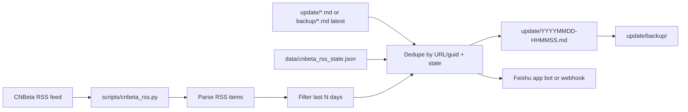

# CNBeta RSS → Feishu aggregator

## Purpose

A small Python script fetches the latest articles from [CNBeta RSS](https://rss.cnbeta.com.tw) and pushes new items to a Feishu group.

## Data flow



1. **Fetch** one or more RSS feeds (default: main CNBeta feed).
2. **Parse** title, link, publish time, category (from URL path), and summary.
3. **Filter** to articles published within the last `CNBETA_RSS_LOOKBACK_DAYS` (default **2**). Older feed entries are ignored even if unseen — no backlog backfill.
4. **Dedupe** the in-window items against article URLs already in `data/cnbeta_rss_state.json` and the latest `update/*.md` (or `update/backup/*.md` when `update/` is empty).
5. **Send** up to `CNBETA_RSS_MAX_ITEMS` (default **20**) new in-window articles to Feishu as an interactive card (or plain text). If nothing qualifies, log `no new CNBeta items`, skip Feishu, and do not write a new markdown snapshot.
6. **Archive** each non-empty batch to `update/YYYYMMDD-HHMMSS.md`; move the previous file to `update/backup/` and link via `上一批: [filename](backup/filename)`.

## Feishu delivery

Two auth modes are supported (auto-detected):

| Mode | Mechanism |
|------|-----------|
| App bot | Tenant access token → `im/v1/messages` (via `scripts/feishu_notify.py`) |
| Webhook | Custom bot webhook POST |

See [feishu-setup.md](./feishu-setup.md) for credentials and chat ID setup.

## RSS source

| Feed | URL | Notes |
|------|-----|-------|
| Main (all categories) | `https://rss.cnbeta.com.tw` | ~150 recent items; categories appear in article URLs (`/articles/tech/`, `/articles/game/`, etc.) |

Category-specific RSS paths return 404; the main feed is the supported source.

## Configuration

Core entrypoint:

```bash
python scripts/cnbeta_rss.py
python scripts/cnbeta_rss.py --ping-feishu   # verify Feishu credentials
```

Feishu credentials live in `.env.local` (see [feishu-setup.md](./feishu-setup.md)). The Python script loads them via `scripts/env_utils.py`; no extra export is needed in cron.

## Scheduled runs

Install with the shared cron helper (same 07:00 / 13:00 / 20:00 Beijing slots as `daily_run`):

```bash
./scripts/setup_cron.sh
```

Wrapper: `scripts/cnbeta_rss.sh` → log `data/cnbeta_rss.log`, crontab marker `# new-movie-tracker-cnbeta`.

## Repository layout

| Path | Role |
|------|------|
| `scripts/cnbeta_rss.py` | Fetch, parse, dedupe, notify |
| `scripts/feishu_notify.py` | Shared Feishu app bot client (tenant token + IM send) |
| `scripts/env_utils.py` | Shared `.env.local` loader |
| `update/` | Per-run markdown news snapshots (`YYYYMMDD-HHMMSS.md`) |
| `update/backup/` | Previous update files archived after each run |
| `data/cnbeta_rss_state.json` | Runtime state (gitignored via `data/`) |
| `docs/feishu-setup.md` | Feishu app + webhook configuration |
| `tests/test_cnbeta_rss.py` | RSS parsing and message tests |

The CNBeta aggregator reuses the Feishu app client from the forum scanner scripts but is otherwise independent of `scan.py` and related tooling.
