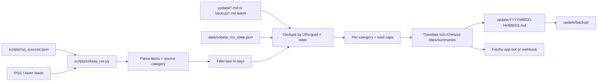

# Multi-source RSS → Feishu aggregator

## Purpose

A Python script fetches curated RSS feeds across eight categories (Chinese/English tech, politics & economics, finance, AI, insights) and pushes new items to a Feishu group. Foreign-language titles and summaries are translated to Simplified Chinese before Feishu push and markdown archive. The entrypoint remains `scripts/cnbeta_rss.py` for backward compatibility with existing cron wrappers.

## Data flow



1. **Load** feeds from `scripts/rss_sources.json` (or legacy `RSS_FEEDS` / `CNBETA_RSS_FEEDS` override).
2. **Filter** sources by `RSS_ENABLED_CATEGORIES` when set.
3. **Fetch** each feed (RSS 2.0 or Atom); failures are logged and skipped.
4. **Parse** title, link, publish time, summary, and assign `source_category` + `source_name`.
5. **Filter** to articles published within the last `RSS_LOOKBACK_DAYS` (default **2**). Older entries are ignored even if unseen — no backlog backfill.
6. **Dedupe** in-window items against `data/cnbeta_rss_state.json` and the latest `update/*.md` (or `update/backup/*.md` when `update/` is empty).
7. **Limit** to `RSS_MAX_ITEMS_PER_CATEGORY` (default **5**) per category and `RSS_MAX_ITEMS` (default **30**) total per run.
8. **Translate** foreign titles/summaries to Simplified Chinese via `scripts/rss_translate.py` (OpenAI-compatible API when `OPENAI_API_KEY` is set; otherwise `deep-translator`). Chinese text is detected by CJK ratio and skipped. Original title/link are preserved; Feishu cards and markdown show **中文标题/摘要** as primary text with originals alongside when different.
9. **Send** grouped by category to Feishu as an interactive card (or plain text). If nothing qualifies, log `no new RSS items`, skip Feishu, and do not write markdown.
10. **Archive** each non-empty batch to `update/YYYYMMDD-HHMMSS.md` with `<!-- category: ... -->` tags; move the previous file to `update/backup/`.

## Categories

| Key | Label | Example sources |
|-----|-------|-----------------|
| `tech_cn` | 中文科技 | CNBeta, IT之家, Solidot, 少数派, 36氪快讯 |
| `tech_en` | 英文科技 | TechCrunch, The Verge, Ars Technica, HN |
| `politics_econ_cn` | 国内政治经济 | 新华网, FT中文, BBC中文, 联合早报 |
| `politics_econ_intl` | 国际政治经济 | BBC World, Guardian, NYT, FT |
| `finance_cn` | 国内财经 | 华尔街见闻, 第一财经, 同花顺 7×24, Investing.com 中文 |
| `finance_intl` | 国际财经 | Bloomberg, FT Markets, CNBC, MarketWatch, WSJ, BBC Business, Yahoo Finance |
| `ai` | AI | 量子位, MIT TR, OpenAI, Google AI, DeepMind |
| `insights` | 热点洞察 | HN 100+, Product Hunt, Lobsters, Techmeme |

Broken or paywalled feeds are listed under `disabled_feeds` in `scripts/rss_sources.json` with RSSHub fallback notes where applicable.

## Feishu delivery

Two auth modes are supported (auto-detected):

| Mode | Mechanism |
|------|-----------|
| App bot | Tenant access token → `im/v1/messages` (via `scripts/feishu_notify.py`) |
| Webhook | Custom bot webhook POST |

Messages and markdown snapshots group items under category headings (e.g. **【中文科技】**).

See [feishu-setup.md](./feishu-setup.md) for credentials and scheduling.

## Configuration

Core entrypoint:

```bash
python scripts/cnbeta_rss.py
python scripts/cnbeta_rss.py --list-sources
python scripts/cnbeta_rss.py --ping-feishu
```

Legacy single-feed mode (ignores JSON catalog):

```bash
CNBETA_RSS_FEEDS=https://rss.cnbeta.com.tw python scripts/cnbeta_rss.py
```

## Repository layout

| Path | Role |
|------|------|
| `scripts/cnbeta_rss.py` | Multi-source fetch, parse, dedupe, translate, notify |
| `scripts/rss_translate.py` | Language detection + batch translation to 中文 |
| `scripts/rss_sources.json` | Curated feed catalog by category |
| `scripts/feishu_notify.py` | Shared Feishu app bot client |
| `scripts/env_utils.py` | Shared `.env.local` loader |
| `update/` | Per-run markdown news snapshots |
| `update/backup/` | Previous update files archived after each run |
| `data/cnbeta_rss_state.json` | Runtime state (gitignored via `data/`) |
| `docs/feishu-setup.md` | Feishu app + webhook + cron configuration |
| `tests/test_cnbeta_rss.py` | RSS parsing, limits, dedup, translation hook, and message tests |
| `tests/test_rss_translate.py` | Translation detection, batching, and bilingual output tests |

## Translation

| Variable | Default | Purpose |
|----------|---------|---------|
| `RSS_TRANSLATE` | `1` | Set `0` to disable translation |
| `OPENAI_API_KEY` | — | Preferred translator (uses `OPENAI_BASE_URL`, `OPENAI_MODEL`) |
| `OPENAI_BASE_URL` | `https://api.openai.com/v1` | Compatible API base |
| `OPENAI_MODEL` | `gpt-4o-mini` | Chat model for batch JSON translations |
| `RSS_TRANSLATE_BATCH_SIZE` | `10` | Strings per API call |
| `RSS_TRANSLATE_CHINESE_THRESHOLD` | `0.35` | CJK ratio above which text is treated as Chinese |

When `OPENAI_API_KEY` is unset, the aggregator falls back to `deep-translator` (Google Translate). Translations are cached in `data/rss_translate_cache.json` (gitignored).

## Cron integration

Scheduled runs use `scripts/cnbeta_rss.sh` (see [PR #66](https://github.com/zjk1984/new-movie-tracker-skill/pull/66)) at **07:00, 13:00, 20:00** Asia/Shanghai alongside the movie tracker. That PR is pending merge; the multi-source aggregator works with manual runs and the same wrapper once cron is installed.

The aggregator reuses the Feishu app client from forum scanner scripts but is otherwise independent of `scan.py`.
